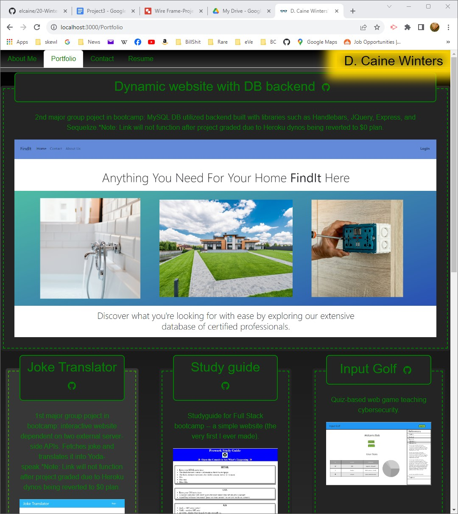

# 20-Projects-Profile

## Description

This is a REACT portfolio web app. It showcases some snippets of my projects to date, provides a brief bio/introduction, and makes available various contact methods.  As of the date I am submitting this for grading, 11/07/2023, I can say that I am proud of where I have molded this app to presently, but the perfectionist in me sees the those little details I just could not figure out.  All this to say nothing of the near endless time that could easily be spent perfecting and perfecting and perfecting and pefecting... The desire to Grok is strong 🖖🏻!

### By: Caine Winters

## Usage

- Navigate to landing page (link below).
- Click through to different pages using the navbar in header or links in footer.
- Submit contact form to send an email.

### Screenshot of app

## Links

### [Link to repo](https://github.com/elcaine/20-Winters-Portfolio-Current)

### [Link to Netlify deployed app](https://main--vermillion-pasca-835da9.netlify.app/)

### Acknowledged sources

- Started with code from original html/css-only project from beginning of class.
- Other sources cited throughout code.
